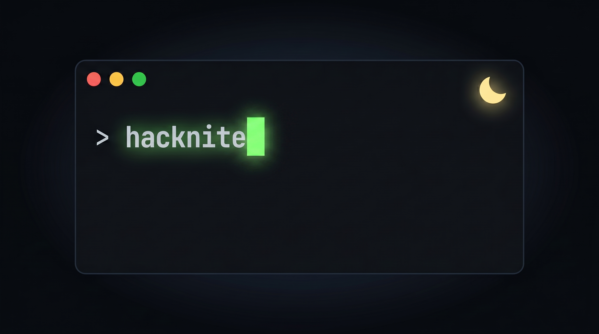

  

# 🌙 Hacknite

**Hacknite** is a collection of small, fast, and useful tools built in overnight coding sessions.

Think of it as a playground for building **simple, practical utilities** without overengineering — just shipping ideas quickly and learning through building.

---

## ⚡ What is Hacknite?

Hacknite is a set of **builder-focused projects** — meaning:

- Built fast (often in a few hours)
- Focused on usefulness over perfection
- Minimal design, maximum function
- No overthinking, just shipping

Each tool solves a small problem.

---

## 🧰 Philosophy

- Build small things that actually work
- Ship before polishing
- Learn by doing
- Keep things simple
- Avoid unnecessary complexity

---

## 🛠️ Projects

Each tool inside Hacknite follows a simple format:

> **Tool Name** — short description  

---

### 💾 [csave](https://github.com/gr1tz/csave-hacknite)

A fast, simple CLI alias creator.

- Create and run terminal aliases on the fly without editing `.bashrc` or `.zshrc`.
- "Store it as-is, fail at runtime." speed.

---

### 🔍 [delta](https://github.com/gr1tz/delta-hacknite)

A fast, completely client-side screenshot comparator.

- Compare two screenshots visually in the browser.
- Side-by-side or overlay view with synchronized X-ray magnifiers.
- Built for privacy (client-side processing).

---

### 📄 [diffly](https://github.com/gr1tz/diffly-hacknite)

A React-based diff viewer utility.

- Compare texts side-by-side.

---

### 🧹 [dupes](https://github.com/gr1tz/dupes-hacknite)

A fast, simple CLI + TUI tool to find and manage duplicate files.

- Scan for duplicate files using chunked hashing.
- Manage them instantly via a built-in Terminal UI.

---

### 🌐 [reqo](https://github.com/gr1tz/reqo-hacknite)

REQuest Observer - a fast, informative CLI tool for making HTTP requests.

---

## 💡 The Goal

Honestly? There is no grand goal. 

Hacknite is just a space to *build*. It's where I drop the heavy planning and just write code to solve immediate, everyday problems. 

It's about:
- Turning a late-night idea into a working tool by morning.
- Prioritizing simple, readable code over complex frameworks.
- Learning by shipping.

Just real, working tools built because building things is fun.

---

## 📌 Naming Convention

Each project usually follows:
